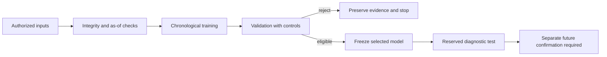

# Causal Research Workbench

[](https://github.com/7ebra/causal-research-workbench/actions/workflows/offline-checks.yml)

An offline-first Python workbench for **time-series validation, reproducible
experiment records, resilient data capture and privacy-aware research handoff**.

Built through AI-assisted experimentation. The portfolio value is the engineering:
observable decisions, immutable inputs, explicit rejection gates and tests that
catch data leakage. **No profitable trading strategy or production deployment is
claimed. There is no broker order-placement implementation.**

## Run the offline example

Python 3.10+; the Python modules use the standard library. No API key or market
subscription is needed for the demo or tests.

```bash
git clone https://github.com/7ebra/causal-research-workbench.git
cd causal-research-workbench
python examples/run_demo.py --out demo-output
python -m unittest discover -s research_lab -p "test_*.py"
python -m unittest discover -s tools/chat_export -p "test_*.py"
```

The demo generates synthetic candles, executes controlled engine fixtures and
writes `demo-output/report.json`, `report.html` and `synthetic-trades.csv`.
Its checks cover chronology, warmup after gaps, duplicate-entry prevention,
settlement timing and explicit missing outcomes. **The fixture policy is deliberately
constructed to exercise mechanics; it is not learned alpha or an investment result.**

## What is reusable

| Component | Engineering purpose | Evidence |
| --- | --- | --- |
| Chronological evaluation | Keep target intervals inside permitted partitions; reset features after gaps | Causal-prefix, split-boundary and gap tests |
| Durable paper engine | Persist independent comparison accounts, observed quotes and decisions in SQLite | Duplicate entry, resume fingerprint, worker lock and settlement tests |
| Read-only practice connectors | Validate bid/ask data; restrict hosts/routes; reconnect with bounded backoff | Host/redirect, credential transport, timeout and recovery tests |
| Frozen trial gates | Record code/data/config hashes before fitting; stop when validation rejects candidates | Protocol mutation, assessment gate and pre-test freeze tests |
| Source provenance | Track actual first observation, original publication and revisions | Archive-date, revision, conditional-language and as-of tests |
| Research handoff | Export recorded user/assistant text with heuristic secret redaction | Partial-record, Unicode, private-message exclusion and redaction tests |

There are **121 offline tests** in this snapshot: 114 research-workbench checks
and seven transcript-export checks. Local verification was performed on Python
3.12/Windows. GitHub Actions separately runs the suite and demo on Windows and
Linux; its badge reports the actual hosted result.

## Architecture



The research harness uses a small tabular semi-Markov Q-learning example with
UP/DOWN/SKIP actions. Its historical fixed-payout rewards are **hypothetical** and
do not represent executable FX returns, broker settlement or calibrated win
probabilities. The financial example is a validation sandbox, not the product.

## Project guide

- [Engineering case study](docs/CASE_STUDY.md): problem, implemented decisions,
  measured operational coverage and limits.
- [Validation methodology](docs/METHODOLOGY.md): timing contracts, controls and
  what constitutes evidence.
- [Reproduce the checks](docs/REPRODUCIBILITY.md): requirements, commands and data
  boundaries.
- [Security and privacy](SECURITY.md): credential handling and publication limits.
- [Synthetic example](examples/synthetic/README.md): repeatable fixtures; no
  licensed market data.
- [Reusable playbooks](playbooks/README.md): research validation, source provenance
  and controlled model updates.
- [Chat exporter](tools/chat_export/README.md): a separate local utility for
  sharing research context without exporting private reasoning.

## Boundaries

This is a prototype and educational case study. Successful unit tests establish
specific software behavior, not statistical alpha or production security.
Operational repairs changed collection/reporting behavior during an original
diagnostic pilot; that run was not clean production validation. All 24 variants
in a later fixed feature comparison remained unapproved, so no selected model
was scored on its reserved test. These constraints are retained rather than
marketing a positive cherry-picked result.

Raw broker data, private databases, actual transcripts, credentials, account IDs,
local session metadata and customer outreach records are intentionally absent.
The published examples are synthetic; source links are documented for provenance.

## Development and attribution

The work was developed with Codex assistance and human direction. This repository
does not imply that every line was written manually or independently audited.
Contributions should include a narrow behavioral test, an explicit data/timing
contract and reproducible evidence. See [CONTRIBUTING.md](CONTRIBUTING.md).

MIT-licensed original code and documentation; external datasets and services
retain their own terms. See [LICENSE](LICENSE).
